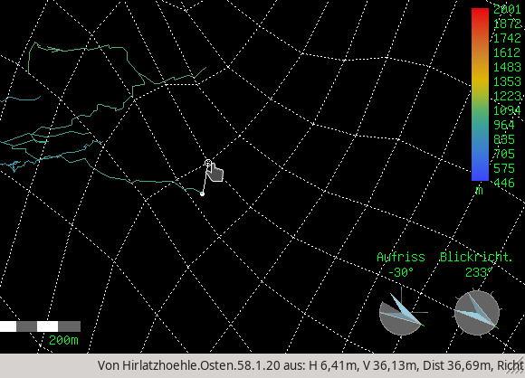

# therionsurface2survex
Convert therion (or GDAL) surface meshes to survex (or therion) surface legs.

```
Usage: [-hsd] [-o outfile] [-i infile] -- [infile]
  -o outfile    File to write to. Will be derived from infile if not specified.  
  -i infile     File to read from, if not given by last parameter. 
  -h            Print this help and exit.
  -s            Skip check of contents - process entire file (use in case
                your therion grid data file has no "surface" declaration
  -t            Export in therion centerline format
  -d            debug mode: spew any action on stdout
```
 
Example: `./therionsurface2survex examples/surface.th`
results in *surface.th.swx* being generated.


## Description
The main intend of this progam is to generate survex surface meshes that will
be processed by survex cavern program. This generates a 3d-file that can be
merged with your cave by therion. This way you can use your existing therion digital elevation
model (DEM) and include it in therions 3d-export; for example to get the distance
from the cave passage to the surface.




#### Input formats
The supported input formats are:

- _Therion source file_  
Assumed is a file containing the `surface`/`endsurface` block. `cs` command will be parsed so the resulting `.swx` will be georeferenced properly.  
In case the data is not inside a `surface` block, you can invoke `-s` parameter to enable parsing of the whole file.

- _GDAL ASCII grid file_  
With `gdal_translate -of AAIGrid ...` you can convert a given heightmap from binary to ASCII, suitable to be used by therion (after adding some therion commands). The programm will recognize the GDAL header in this ASCII grid file and ceate the `.swx`.  
The drawback is, that the grid file does not contain any coordinate system reference, so you need to add this manually afterwards (eg. add `*cs EPSG:31258` and `*cs out EPSG:31258` into the resulting `.swx` at the start of the file).


#### Output formats
The supported output formats are:

- _Survex_ (default)  
The output file is in survex `.swx` format, suitable to be processed from
`cavern` to create a survex 3d-file, which contains the 3d mesh.  
Each grid section is translated to a station. Station names follow the
naming scheme `surface.<row>.<column>`, where row and column is the cell address
from the source therion file.

- _Therion source file_ (with `-t`)  
The output is in therions `.th` centerline format, suitable to be `source`'d
from therion `thconfig` files which may be even easier to combine with
you cave data in therion.


## How it operates
It reads the input file line by line and tries to parse any relevant therion
commands (or GDAL headers), most notably `cs`, `grid` and of couse the grids data.
It tries to skip lines outside of "surface" blocks and as a last resort starts
parsing when detecting a "grid" command.

In case you separate the grid data from the surrounding therion commands (like
surface, bitmap, cs and so on), you can use the `-s` option to disable the
checks alltogether, which results in the whole file being tried to be parsed.
This may yield wrong results in case you are combining centerline data and
surface data in one file.


## Compiling and running
You can compile the progam by just invoking "make". The resulting binary should
be usable as-is. In fact it can be compiled by g++ and has no library dependencies
(aside from the default ones).  
The current version, invocation and available options can be retrieved with
option `-h`.


## Integrating the results back into therion
One main use case for me was that i wanted to convert the existing DEM from the
Hirlatz/Dachstein into survex so i can take exact measurements of cave tunnels
to the surface. However it is also very convinient to take measurements from
different points of the surface (like heights of walls or distances from peaks).
For this to work, you need to create a combined 3d-file with your cave and the
new surface 3d file.

#### Combining several survex/aven 3d-files
Integration is easy, once you know how it works. You need to prepare some
therion source file to `import` your 3d file. See the therion book fo examples.  
(this method is needed because aven currently does not support opening
several files in parallel in one window)

A short example may be a single thconfig file like this:
```
source
  import myCave.th.3d -surveys ignore
  import mySurface.3d -surveys ignore
endsource

export model -o myCave_with_mySurface.3d
```

#### Combine using therion native format (-t option)
Things get even easier if you directly export a native therion surface mesh.
This can be activated either by ending the output file parameter `-o` with a name
ending in `.th` or by explicitely requesting the `-t`parameter.  
Exporting directly to therion native format allows you more fine control.

A short example may be a single thconfig file like this:
```
source myCave.th
source mySurface.th

export model -o myCave_with_mySurface.3d
```


## Alternatives
Survex 1.2.18 added support for loading terrain data and rendering it as a transparent surface in `aven`. As far as i know this is similar to therions `loch` terrain feature, where a transparent height model is displayed.  
However neither of both viewers currently support the distinct selection of points on the surface, so no measurements can be taken.
